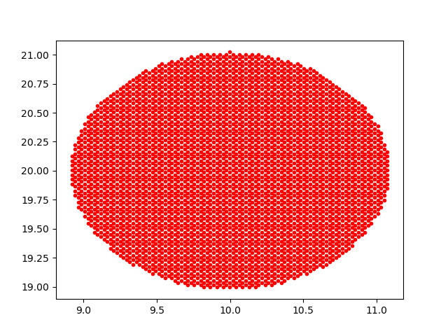
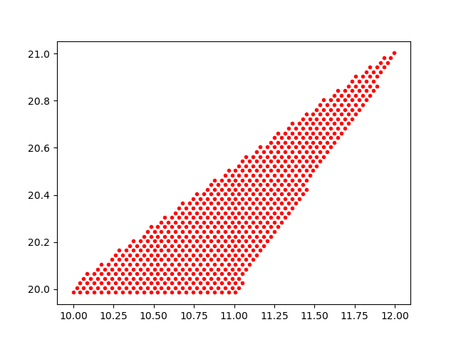
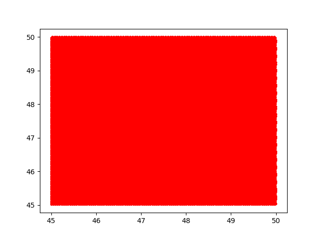
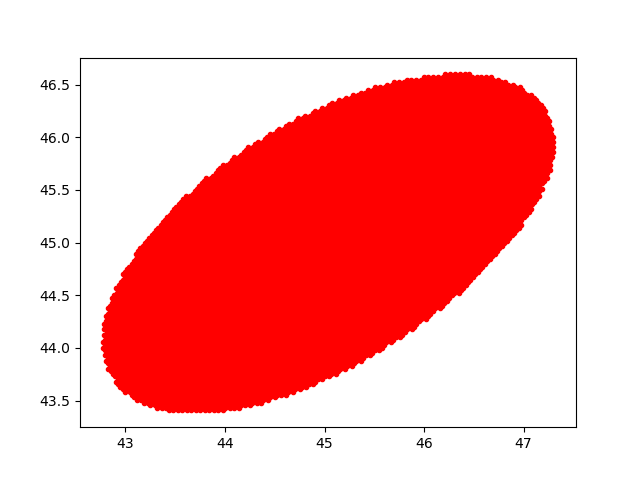
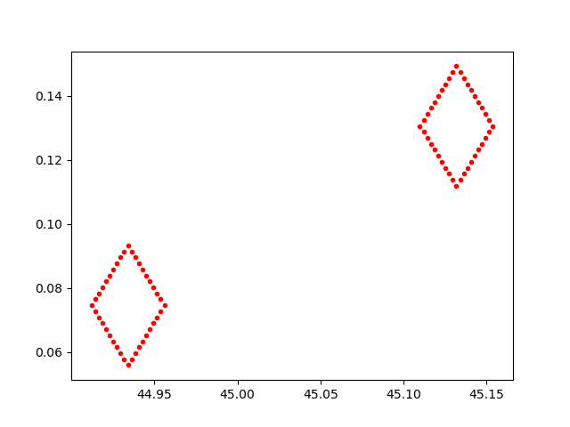
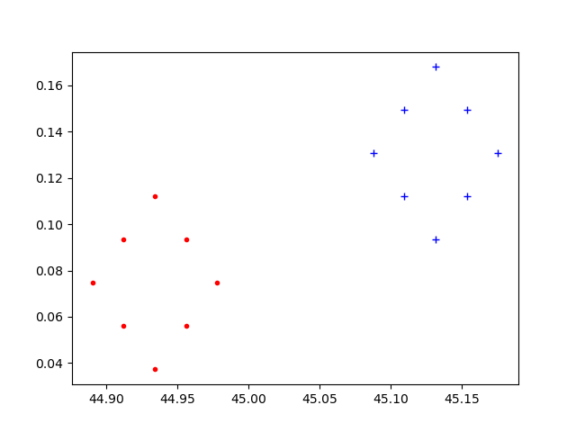

.. _basic-interface:
.. role:: python(code)
   :language: python

Basic HPGeom Interface
======================

Getting Started
---------------

`HPGeom` is a lightweight implementation of HEALPix geometry functions, wrappedin a numpy_ interface.
The implementation is based on the geometric functions in the original HEALPix_ C++ library code.
`HPGeom` has an all-new API, but there are compatibility functions with the same interfaces as healpy_ for easy transition from healpy_ to `HPGeom`.

Because `HPGeom` contains only geometric routines, there are no facilities for reading or writing HEALPix_ maps, nor are there any visualization routines.
Furthermore, there are no spherical harmonic functions which operate on full maps.
For reading and writing maps efficiently, please consider using HealSparse_.
For visualization of HEALPix_ and HealSparse_ maps, please consider using SkyProj_.

The tutorial examples here assume matplotlib_ has been installed, for simple visualizations and usage examples.
However, matplotlib_ is not required for any `HPGeom` functionality.

Key Differences Between healpy_ and `HPGeom`
--------------------------------------------

There are a few key differences between the healpy_ and `HPGeom` interfaces that a user familiar with healpy_ should be aware of.
These include:

* The default ordering scheme in `HPGeom` is ``nest`` rather than ``ring``.
  This is because the heirarchical ``nest`` ordering scheme is more natural when using HEALPix_ as a geometry library (while ``ring`` is more natural when computing spherical harmonics).
  To override the default, the keyword :code:`nest=False` can be applied to all relevant functions.
* The default angular coordinates for `HPGeom` are longitude and latitude, expressed in degrees, rather than co-latitude and longitude in radians.
  Longitude and latitude will be in degrees if the keyword :code:`degrees=True` (the default), and otherwise will be in radians.
  Angular coordinates will be in units of co-latitude (theta) and longitude (phi) if the keyword :code:`lonlat=False` is used.
  Note that theta/phi are always in radians.
* For many routines which return multi-dimensional arrays, such as :code:`hpgeom.boundaries()`, the output ordering is the transpose of the healpy_ output format, such that it returns an array of shape :code:`(N, 4*step,)`.
  This ordering requires fewer moves of data in memory for the default numpy_ memory ordering.

Conversion Between Angles and Pixels
------------------------------------

The simplest operation is the conversion between angles and pixels.
As noted above, this will return the pixel values in the nest ordering scheme by default.
The interface looks like:

.. code-block :: python

    import hpgeom as hpg

    nside = 2048
    lon = np.arange(10, dtype=np.float64)
    lat = np.arange(10, dtype=np.float64)
    pixels_nest = hpg.angle_to_pixel(nside, lon, lat)

    pixels_ring = hpg.angle_to_pixel(nside, lon, lat, nest=False)
    # or
    pixels_ring = hpg.nest_to_ring(nside, pixels_nest)

And to do the reverse operation, we simply do:

.. code-block :: python

    import hpgeom as hpg

    nside = 2048
    pixels_nest = np.arange(10)
    lon, lat = hpg.pixel_to_angle(nside, pixels_nest)

    theta, phi = hpg.pixel_to_angle(nside, pixels_nest, lonlat=False)
    # or
    theta, phi = hpg.lonlat_to_thetaphi(lon, lat)

Pixel Queries
-------------

There are several routines in `HPGeom` to query for pixels contained within various shapes.
These routines follow the same ``inclusive`` algorithm as healpy_, and use the same over-sampling method to estimate which pixels may overlap with a given shape.
This algorithm is designed to possibly return extra pixels, depending on the :code:`fact` parameter.
The overlap test is performed at a resolution :code:`fact*nside`.
For nest ordering, :code:`fact` must be a power of 2, and :code:`nside*fact` must always be :code:`<= 2**29`.
For ring ordering, :code:`fact` may be any positive integer.

The `HPGeom` :code:`query_circle()` function behaves much the same as the healpy_ :code:`query_disc()`.
It returns pixels whose centers lie within the circle defined by the central coordinate and radius if :code:`inclusive=False`, or which overlap with the circle if :code:`inclusive=True`.
A key difference is that :code:`hpgeom.query_circle()` takes as input spherical coordinates rather than unit-vector coordinates.
Note that this function is more efficient with ``ring`` ordering, though it is often faster overall to use ``nest`` ordering directly rather than do the query with ``ring`` ordering and convert to ``nest``.

.. code-block :: python

    import hpgeom as hpg
    import matplotlib.pyplot as plt

    # Return all pixels within 1 degree of lon=10 degrees, lat=20 degrees,
    # including all pixels with partial coverage.
    pixels = hpg.query_circle(2048, 10.0, 20.0, 1.0, inclusive=True)
    lon, lat = hpg.pixel_to_angle(2048, pixels)

    plt.plot(lon, lat, 'r.')
    plt.show()

The `HPGeom` :code:`query_polygon()` function behaves much the same as the healpy_ :code:`query_polygon()`.
It returns pixels whose centers lie within the convex polygon defined by the points listed if :code:`inclusive=False`, or which overlap with the polygon if :code:`inclusive=True`.
All edges of the polygon will be great circles.
A key difference is that :code:`hpgeom.query_polygon()` takes as input spherical coordinates rather than unit-vector coordinates.
Note that this function is more efficient with ``nest`` ordering.

.. code-block :: python

    import hpgeom as hpg
    import matplotlib.pyplot as plt

    # Return all pixels within a triangle, including all pixels with
    # with partial coverage.
    pixels = hpg.query_polygon(
        2048,
        [10.0, 12.0, 11.0],
        [20.0, 21.0, 20.0],
        inclusive=True,
    )
    lon, lat = hpg.pixel_to_angle(2048, pixels)

    plt.plot(lon, lat, 'r.')
    plt.show()

The `HPGeom` :code:`query_box()` function does not have a direct analog in healpy_.
This function returns pixels whose centers lie within a box if :code:`inclusive=False` or which overlap with the box if :code:`inclusive=True`.
The box is defined by all the points within :code:`[a0, a1]` and :code:`[b0, b1]`.
The box will have boundaries in constant longitude/latitude, rather than great circle boundaries as with :code:`query_polygon()`.
If :code:`a0 > a1` then the box will wrap around 360 degrees.
If :code:`a0 == 0.0` and :code:`a1 == 360.0` then the box will contain points at all longitudes.
If :code:`b0 == 90.0` or :code:`b0 == -90.0` then the box will be an arc of a circle with the center at the north/south pole.
The box definition is derived from lsst-sphgeom_.

.. code-block :: python

    import hpgeom as hpg
    import matplotlib.pyplot as plt

    pixels = hpg.query_box(2048, 45.0, 50.0, 45.0, 50.0)
    lon, lat = hpg.pixel_to_angle(2048, pixels)

    plt.plot(lon, lat, 'r.')
    plt.show()

The `HPGeom` :code:`query_ellipse()` function also does not have a direct analog in healpy_.
This function returns pixels whose centers lie within an ellipse if :code:`inclusive=False` or which overlap with the ellipse if :code:`inclusive=True`.
The ellipse is defined by a center :code:`a, b` and semi-major and semi-minor axes.
The inclination angle :code:`alpha` is defined East of North.
The shape of the ellipse is defined by the set of points where the sum of the distances from a point to each of the foci add up to less than twice the semi-major axis.

Note that this method runs natively only with nest ordering.
If called with ring ordering then a :code:`ResourceWarning` is emitted, and the pixel numbers will be converted to ring and sorted before output.

.. code-block :: python

    import hpgeom as hpg
    import matplotlib.pyplot as plt

    pixels = hpg.query_ellipse(2048, 45.0, 45.0, 2.0, 1.0, 45.0, inclusive=True)
    lon, lat = hpg.pixel_to_angle(2048, pixels)

    plt.plot(lon, lat, 'r.')
    plt.show()

Pixel Boundaries and Neighbors
------------------------------

There are routines in `HPGeom` to compute pixel boundaries and neighbors.

The `HPGeom` :code:`boundaries` function behaves similarly to the healpy_ :code:`boundaries()`.
It returns a pair of arrays containing the longitude/latitude coordinate pairs describing the boundary of the specified pixel(s).
Unlike healpy_, the `HPGeom` version returns positions rather than vectors.
Furthermore, the returned arrays have the shape :code:`(npixel, 4*step)` (where :code:`step` is the number of steps for each side of the pixel) rather than the equivalent transpose for healpy_.
In order to get coordinates for just the corners of the specified pixels, specify :code:`step=1`.

.. code-block :: python

    import hpgeom as hpg
    import matplotlib.pyplot as plt

    bounds_lon, bounds_lat = hpg.boundaries(2048, [10, 20], step=10)

    plt.plot(bounds_lon, bounds_lat, 'r.')
    plt.show()

The `HPGeom` :code:`neighbors` function is similar to healpy_ :code:`get_all_neighbours()`.
It returns the 8 nearest neighbors for the given list of pixels.
The returned array has the pixel ordering of SW, W, NW, N, NE, E, SE, and S neighbors.
If a neighbor does not exist (as can be the case for W, N, E, and S) the corresponding pixel number will be -1.
Note that the returned shape is :code:`(N, 8)`, which is the transpose of that returned by healpy_.

.. code-block :: python

    import hpgeom as hpg
    import matplotlib.pyplot as plt

    neighbors = hpg.neighbors(2048, [10, 20])

    lon, lat = hpg.pixel_to_angle(2048, neighbors)

    plt.plot(lon[0, :], lat[0, :], 'r.')
    plt.plot(lon[1, :], lat[1, :], 'b+')
    plt.show()

The `HPGeom` :code:`get_interpolation_weights()` function is the analog to healpy_ :code:`get_interp_weights()`.
It returns the four closest pixels and weights to perform bilinear interpolation along longitude and latitude.
As `HPGeom` does not handle full maps, it does not perform interpolation, but these weights are used by other code such as HealSparse_ to perform map interpolation.
As with the other routines, the returned ordering is :code:`(N, 4)`, a transpose of that returned by healpy_.

.. code-block :: python

    import hpgeom as hpg

    pixels, weights = hpg.get_interpolation_weights(2048, 12.234, 45.3445)

Healpy Compatibility Module
---------------------------

For ease of transitioning from healpy_ to `HPGeom`, a healpy_ compatibility module is provided.
This module contains interfaces to the `HPGeom` functionality that are identical to healpy_, including all the same defaults (e.g. :code:`nest=False` and :code:`lonlat=False`).
All routines here are tested to return identical values to healpy_.

.. code-block :: python

    import hpgeom.healpy_compat as hpc

    pixels = hpc.ang2pix(2048, 0.0, 0.0)
    theta, phi = hpc.pix2ang(2048, pixels)

.. _HEALPix: https://healpix.jpl.nasa.gov/
.. _healpy: https://healpy.readthedocs.io/en/latest/
.. _numpy: https://numpy.org/
.. _HealSparse: https://healsparse.readthedocs.io/en/latest/
.. _SkyProj: https://skyproj.readthedocs.io/en/latest/
.. _lsst-sphgeom: https://pypi.org/project/lsst-sphgeom/
.. _matplotlib: https://matplotlib.org
